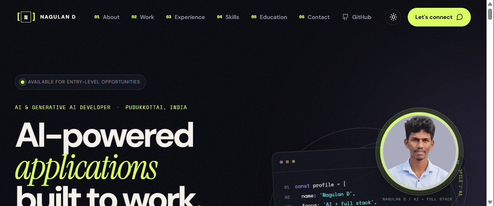

# Nagulan D Portfolio



Personal portfolio for Nagulan D, an AI and Generative AI developer building practical machine-learning, backend, and full-stack applications.

## Highlights

- Responsive portfolio experience with dark and light themes.
- Project-led showcase for ThreatGuard, disease prediction, and full-stack applications.
- Experience, education, certifications, technical skills, and repository links.
- Direct profile photo and resume assets bundled with the site.
- Native resume download at `/assets/Nagulan_Resume_Gen_AI.pdf`.
- GitHub Pages deployment through GitHub Actions.

## Tech Stack

- React 19 and TypeScript
- Vite
- Tailwind CSS and custom CSS
- Lucide React icons
- pnpm

## Run Locally

```bash
corepack pnpm install --frozen-lockfile
corepack pnpm dev
```

Open `http://localhost:3000/`. If that port is busy, Vite will select the next available port.

## Validate

```bash
corepack pnpm check
corepack pnpm build
```

## Deployment

Pushes to `main` run [.github/workflows/deploy.yml](.github/workflows/deploy.yml), build the Vite client, and publish `dist/public` to GitHub Pages.

Live site: [nagulan-d.github.io](https://nagulan-d.github.io/)

## Contact

- LinkedIn: [nagulan-d](https://www.linkedin.com/in/nagulan-d-84b197258/)
- GitHub: [nagulan-d](https://github.com/nagulan-d)
- Email: [naguland.tech@gmail.com](mailto:naguland.tech@gmail.com)